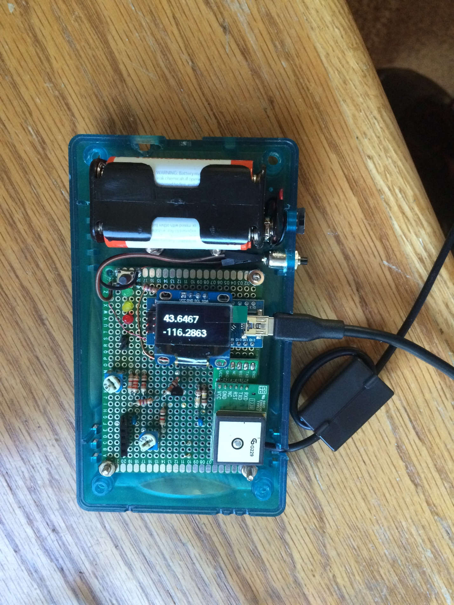

# Aprs-Tracker

Source code for APRS Tracker project: https://easyeda.com/spgsm/aprs-oled

Schematic:

# Circuit Notes

Your Mileage May Vary.

## * * *

On my cheap Baofeng radio, there was quite a bit of reflected RF coming back into the circuit that wouldn’t allow the PTT circuit to properly disengage.

To resolve this, you need a ferrite choke on the AUDIO and PTT lines to your radio. (Just loop the whole cable through the choke a couple times and test to see if it works).

## * * *

The original schematic shows a 4.7uf Cap to couple the audio. One version shows an electrolytic and another version shows a ceramic. I don’t believe it matters. I ran the circuit successfully with both a 1uf and a 10uf cap, neither electrolytic.

## * * *

To debug, hook up 2 of the modems together. Use the LINE out from the sending modem. If you use the Mic out signal, it won’t be high enough voltage wise to decode. (The Arduino adc isn’t sensitive enough).

## * * *

I had problems getting packets to be decoded by the digipeaters. To resolve this, I put in the 100k trimmer replacing a 100k resistor. Then I turned it down almost as far as it would go. And, I broadcast to another radio that I could listen to and listened to my audio signal to see if it was distorting. Then, adjusted the trimmer as high as I could make it until just before it starts to distort.

This made so some of the packets were decoded.

## * * *

The original page for a lot of this is at http://unsigned.io and my circuit is nearly a clone of Mark’s. The folks in the forum there are pretty helpful. If you get stuck, try them out.

## * * *

I order the Arduino / gps / display from a local guy. His store is: http://squareup.com/market/just-for-fun-6

And my layout:

## * * *

4/15/15 And what may be the final update. Tonight (with no changes to the circuit) it works nearly 100%. The difference is antenna side. The cheap radio is plugged into a copper Jpole out on the roof.

I did tweak the 100k pot a bit yesterday when I measured voltage and I’m getting just about 200mV p-p on the modem signal out as I look at it today.

So. Antenna matters significantly and signal quality matters significantly. And now many things make a lot more sense. The last time it decoded ok was also using a ¾ wave jpole made from ladder line, but it was inside the house. That accounts for the problem decoding. When it was in the other room plugged into an external ¼ wave vertical, it had some decoding but was still getting quite a bit of reflected power back. The duck has never worked well as an antenna. The ¼ vertical on the car did mediocre, but it’s a lousy antenna based on price.

Circuit is good and decodes basically at 100%.

Now to update the code for some part of a speed calculation…
